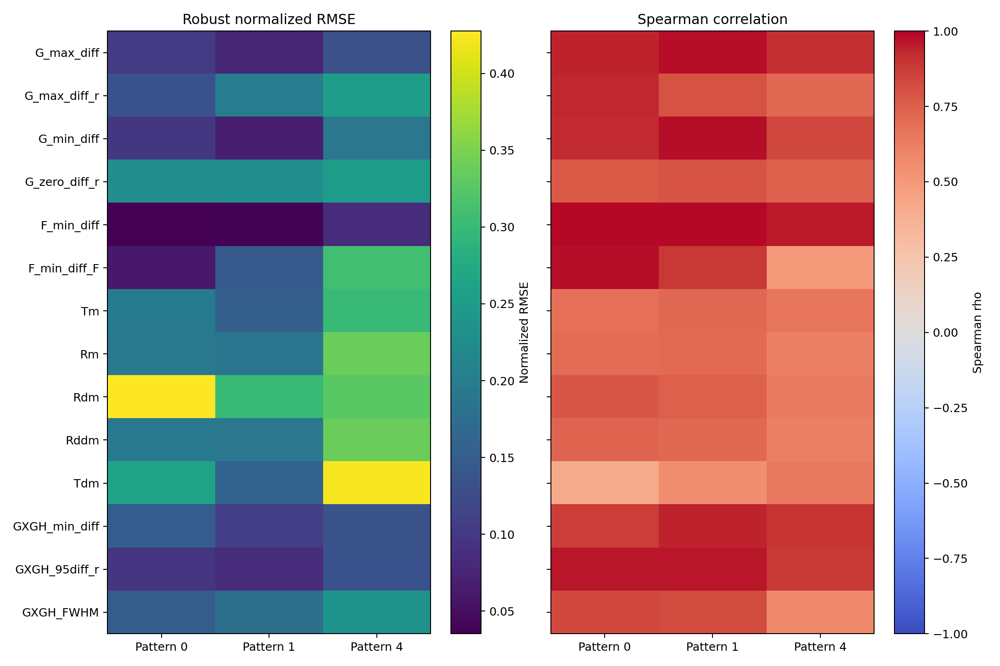
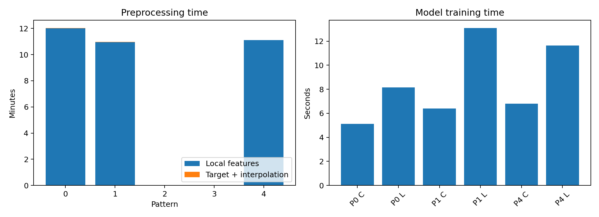
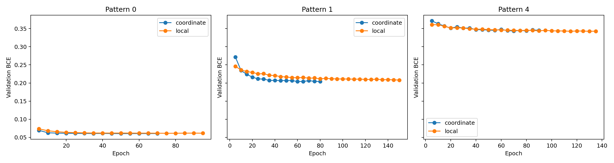
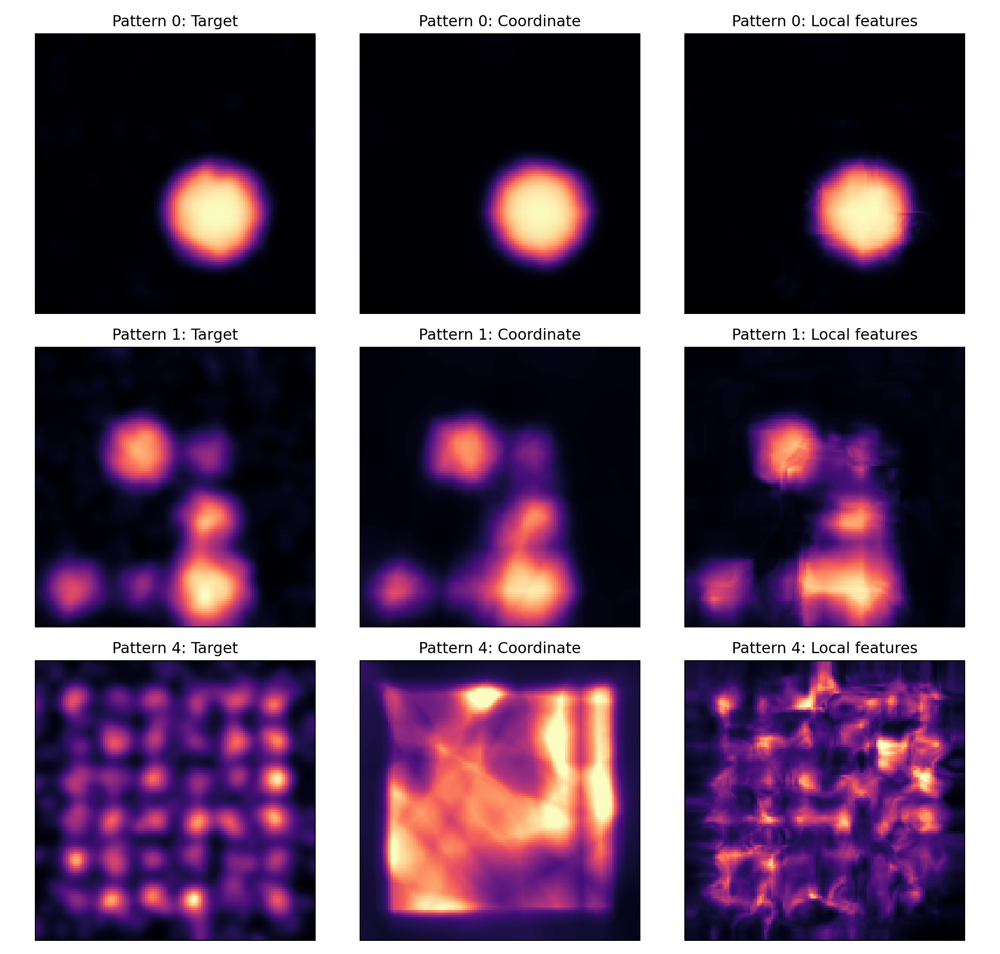
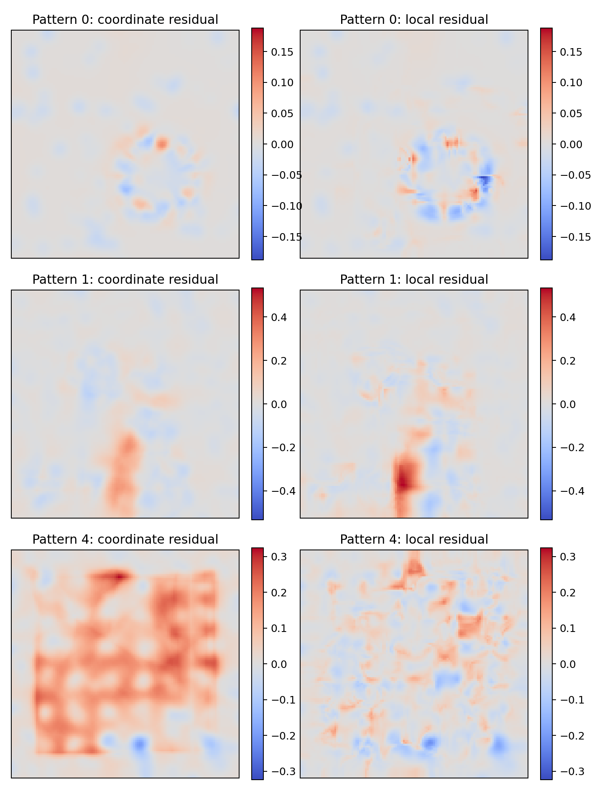
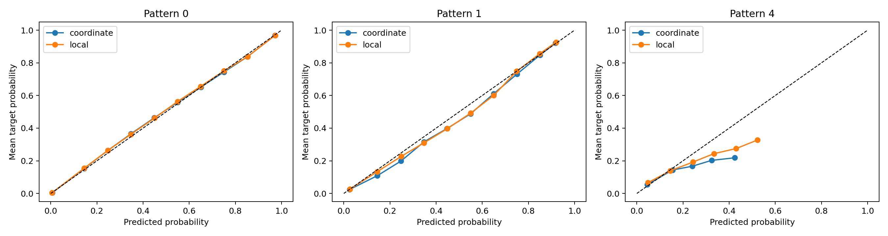
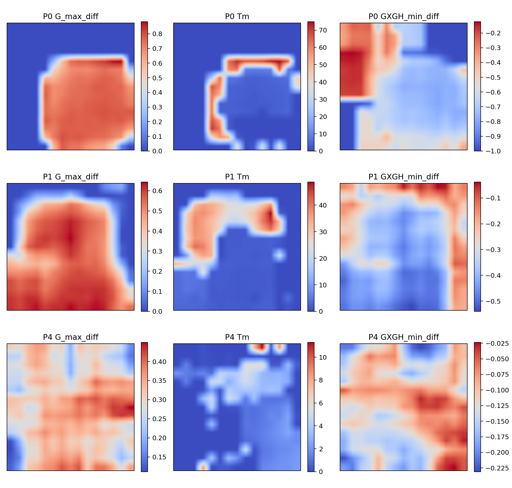

# Experimental Methodology 01 Report

## Executive Summary

The local-feature approach **DOES NOT ADVANCE** under the prespecified screening criteria.

- Interpolation passed for 0/3 patterns.
- Local improved both Brier and Dice in 1/3 patterns.
- Median relative Brier improvement was -38.08%.
- Median absolute Dice improvement was -0.0261.
- Worst relative Brier degradation was 223.88%.

Because interpolation failed, the trained-model results below are exploratory diagnostics. They do not override the prespecified interpolation stopping rule.

## Experimental Design

Patterns: 0, 1, 4.
Whole-pattern random relabelings: 89.
Coarse feature spacing: 4.0 units.
Exact interpolation checks per pattern: 256.
Models: coordinate-only and coordinate-plus-14-local-features for each pattern.
Loss: unweighted binary cross-entropy with balanced cluster/background training batches.
Validation: complete held-out spatial blocks.

## Interpolation Validation

| Pattern | Median normalized RMSE | Features with Spearman >= 0.80 | Maximum radius-feature error | Result |
| --- | ---: | ---: | ---: | --- |
| 0 | 0.1502 | 8/14 | 0.4275 | FAIL |
| 1 | 0.1557 | 8/14 | 0.2991 | FAIL |
| 4 | 0.2535 | 5/14 | 0.3377 | FAIL |

### Feature-level interpolation statistics

| Feature | Mean normalized RMSE | Mean Spearman | Minimum Spearman |
| --- | ---: | ---: | ---: |
| G_max_diff | 0.1038 | 0.9433 | 0.9086 |
| G_max_diff_r | 0.1969 | 0.8173 | 0.7157 |
| G_min_diff | 0.1194 | 0.9142 | 0.8356 |
| G_zero_diff_r | 0.2363 | 0.7690 | 0.7474 |
| F_min_diff | 0.0522 | 0.9789 | 0.9564 |
| F_min_diff_F | 0.1718 | 0.7901 | 0.5031 |
| Tm | 0.2160 | 0.6877 | 0.6589 |
| Rm | 0.2405 | 0.6739 | 0.6163 |
| Rdm | 0.3514 | 0.7230 | 0.6403 |
| Rddm | 0.2406 | 0.6888 | 0.6202 |
| Tdm | 0.2810 | 0.5341 | 0.4099 |
| GXGH_min_diff | 0.1305 | 0.9022 | 0.8700 |
| GXGH_95diff_r | 0.1046 | 0.9375 | 0.8849 |
| GXGH_FWHM | 0.1895 | 0.7452 | 0.5767 |

## Computational Benchmarks

| Pattern | Feature time (min) | Interpolation time (min) | Total preprocessing (min) |
| --- | ---: | ---: | ---: |
| 0 | 12.01 | 0.01 | 12.03 |
| 1 | 10.96 | 0.01 | 10.97 |
| 4 | 11.10 | 0.01 | 11.12 |

Total preprocessing time was 34.12 minutes. This was much faster than the seven-hour planning estimate because the small calibration run did not scale linearly to the larger, reused whole-pattern relabeling workload.

## Model Metrics

| Pattern | Model | Brier | BCE | MAE | RMSE | Dice | PR-AUC | ECE | Spearman | Components | Centroid error |
| --- | --- | ---: | ---: | ---: | ---: | ---: | ---: | ---: | ---: | ---: | ---: |
| 0 | coordinate | 0.000145 | 0.060428 | 0.006727 | 0.012031 | 0.9609 | 0.9788 | 0.002900 | 0.3909 | 2 | 0.192 |
| 0 | local | 0.000469 | 0.061329 | 0.008179 | 0.021652 | 0.9348 | 0.9721 | 0.001620 | 0.4476 | 8 | 8.958 |
| 1 | coordinate | 0.003666 | 0.204093 | 0.029951 | 0.060549 | 0.8689 | 0.9505 | 0.008558 | 0.5896 | 4 | 0.769 |
| 1 | local | 0.005062 | 0.208103 | 0.033292 | 0.071149 | 0.8309 | 0.9171 | 0.005876 | 0.5940 | 5 | 0.525 |
| 4 | coordinate | 0.008408 | 0.343595 | 0.066467 | 0.091697 | 0.2146 | 0.2014 | 0.028563 | 0.6466 | 21 | 3.241 |
| 4 | local | 0.006968 | 0.342523 | 0.058169 | 0.083473 | 0.4021 | 0.3583 | 0.022415 | 0.6417 | 72 | 4.919 |

### Correlation, morphology, and compute

| Pattern | Model | Pearson | Target components | Predicted components | Component recovery | Median volume error | Best epoch | Parameters | Train time (s) | Inference (s) |
| --- | --- | ---: | ---: | ---: | ---: | ---: | ---: | ---: | ---: | ---: |
| 0 | coordinate | 0.9976 | 21 | 2 | 0.0952 | 0.0532 | 50 | 33665 | 5.12 | 0.48 |
| 0 | local | 0.9920 | 21 | 8 | 0.0952 | 0.9686 | 75 | 35457 | 8.15 | 0.55 |
| 1 | coordinate | 0.9564 | 5 | 4 | 1.0000 | 0.1405 | 60 | 33665 | 6.39 | 0.50 |
| 1 | local | 0.9375 | 5 | 5 | 1.0000 | 0.3968 | 150 | 35457 | 13.09 | 0.58 |
| 4 | coordinate | 0.5381 | 60 | 21 | 0.5500 | 0.9937 | 70 | 33665 | 6.81 | 0.48 |
| 4 | local | 0.5979 | 60 | 72 | 0.9000 | 0.9550 | 115 | 35457 | 11.64 | 0.57 |

Total optimizer time across all six models was 51.20 seconds. Connected-component metrics are calculated only inside the held-out blocks, so regions crossing block boundaries can be fragmented; these morphology values are secondary diagnostics.

## Paired Comparisons

| Metric | Coordinate mean | Local mean | Median local-minus-coordinate | Local favorable patterns |
| --- | ---: | ---: | ---: | ---: |
| brier | 0.004073 | 0.004166 | 0.000324 | 1/3 |
| dice_top10 | 0.681462 | 0.722618 | -0.026071 | 1/3 |
| pr_auc_top10 | 0.710250 | 0.749200 | -0.006706 | 1/3 |
| ece_10 | 0.013340 | 0.009970 | -0.002683 | 3/3 |
| median_centroid_error | 1.400910 | 4.800603 | 1.677758 | 1/3 |

With only three paired patterns and one training seed, inferential p-values are not interpreted. The paired differences are screening effect sizes.

## Interpretation and Decision

- Pattern 0: relative Brier improvement -223.88%, Dice change -0.0261, PR-AUC change -0.0067, and ECE change -0.0013.
- Pattern 1: relative Brier improvement -38.08%, Dice change -0.0380, PR-AUC change -0.0334, and ECE change -0.0027.
- Pattern 4: relative Brier improvement +17.13%, Dice change +0.1875, PR-AUC change +0.1569, and ECE change -0.0061.

Calibration improved for the local model in 3/3 patterns, but calibration alone is not sufficient to satisfy the advancement gate.

The smoothest interpolated channels were F_min_diff (rho=0.979), G_max_diff (rho=0.943), GXGH_95diff_r (rho=0.938), G_min_diff (rho=0.914), GXGH_min_diff (rho=0.902). The least reliable were Tdm (rho=0.534), Rm (rho=0.674), Tm (rho=0.688), Rddm (rho=0.689), Rdm (rho=0.723).

The primary result is that spacing-4 trilinear interpolation of all 14 extracted local features is not validated. Several extrema and radius-derived channels are too spatially irregular at this resolution. The local model's substantial improvement on the fine-cluster pattern shows that local information may still be useful, but the present representation is not reliable enough to advance.

The next controlled experiment should keep the same split, loss, sampling, and evaluation protocol while changing only feature construction: use a finer or adaptive local grid, interpolate the underlying summary-function curves before extracting extrema, or prespecify a reduced subset of the smoothly interpolated channels. Repeat across multiple seeds only after the interpolation gate passes.

Limitations: this is a three-pattern, one-seed screening experiment; no inferential significance claim is supported. Held-out blocks can fragment connected targets, so connected-component metrics remain secondary to voxelwise, ranking, and calibration metrics.

## Files

- `interpolation_metrics.csv`: per-feature interpolation statistics.
- `model_metrics.csv`: complete model metrics when training was run.
- Pattern directories contain point splits, feature grids, masks, predictions, histories, checkpoints, and timings.
